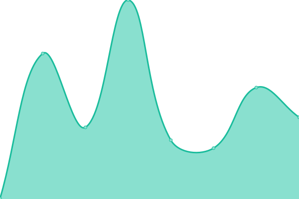
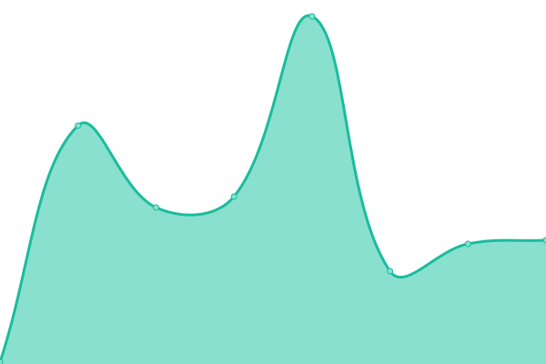

# [📈 Live Status](https://mandarnaik016.github.io/Upptime): <!--live status--> **🟩 All systems operational**

This repository contains the open-source uptime monitor and status page for [Mandar Naik](https://mandarnaik016.github.io/), powered by [Upptime](https://github.com/upptime/upptime).

With [Upptime](https://upptime.js.org), you can get your own unlimited and free uptime monitor and status page, powered entirely by a GitHub repository. We use [Issues](https://github.com/mandarnaik016/Upptime/issues) as incident reports, [Actions](https://github.com/mandarnaik016/Upptime/actions) as uptime monitors, and [Pages](https://mandarnaik016.github.io/Upptime) for the status page.

<!--start: status pages-->
<!-- This summary is generated by Upptime (https://github.com/upptime/upptime) -->
<!-- Do not edit this manually, your changes will be overwritten -->
<!-- prettier-ignore -->
| URL | Status | History | Response Time | Uptime |
| --- | ------ | ------- | ------------- | ------ |
|  [crackrepack](https://www.crackrepack.xyz/) | 🟩 Up | [crackrepack.yml](https://github.com/mandarnaik016/Upptime/commits/HEAD/history/crackrepack.yml) | 

 152ms
     
 | 

<a href="https://mandarnaik016.github.io/Upptime/history/crackrepack">100.00%</a>
    

|  [file.crackrepack](https://file.crackrepack.xyz/) | 🟩 Up | [file-crackrepack.yml](https://github.com/mandarnaik016/Upptime/commits/HEAD/history/file-crackrepack.yml) | 

 67ms
     
 | 

<a href="https://mandarnaik016.github.io/Upptime/history/file-crackrepack">100.00%</a>
    

|  [url.crackrepack](https://url.crackrepack.xyz/) | 🟩 Up | [url-crackrepack.yml](https://github.com/mandarnaik016/Upptime/commits/HEAD/history/url-crackrepack.yml) | 

 59ms
     
 | 

<a href="https://mandarnaik016.github.io/Upptime/history/url-crackrepack">100.00%</a>
    

|  [bin.crackrepack](https://bin.crackrepack.xyz/) | 🟩 Up | [bin-crackrepack.yml](https://github.com/mandarnaik016/Upptime/commits/HEAD/history/bin-crackrepack.yml) | 

 62ms
     
 | 

<a href="https://mandarnaik016.github.io/Upptime/history/bin-crackrepack">100.00%</a>
    

|  [drive.crackrepack](https://drive.crackrepack.xyz/) | 🟩 Up | [drive-crackrepack.yml](https://github.com/mandarnaik016/Upptime/commits/HEAD/history/drive-crackrepack.yml) | 

 58ms
     
 | 

<a href="https://mandarnaik016.github.io/Upptime/history/drive-crackrepack">100.00%</a>
    

<!--end: status pages-->

[**Visit our status website →**](https://mandarnaik016.github.io/Upptime)

## 📄 License

- Powered by: [Upptime](https://github.com/upptime/upptime)
- Code: [MIT](./LICENSE) © [Anand Chowdhary](https://anandchowdhary.com), supported by [Pabio](https://pabio.com)
- Data in the `./history` directory: [Open Database License](https://opendatacommons.org/licenses/odbl/1-0/)
